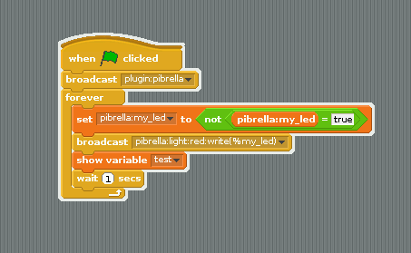
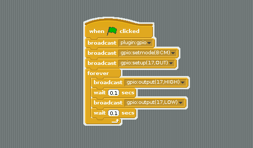
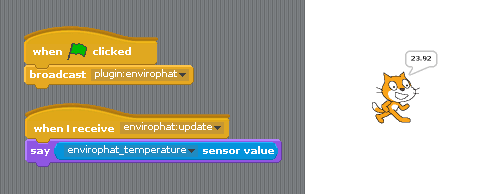

#ScratchIO
##An extensible, plugin-based Scratch IO framework

ScratchIO is an attempt to create a flexible, open and powerful
framework for communicating with Scratch using the remote sensors protocol.

ScratchIO is built around a plugin architecture, with each plugin handling
a single device. Plugins can be derived from the common plugin class, which
grants them automatic tracking of variables and parsing of commands against
their target library.

##Super Simple Example

First, fire up Scratch and enable remote sensor connections by right
clicking on the "sensor value" block under Sensing.

Next, fire up ScratchIO like so:

```bash
sudo ./scratchio.py
```

To communicate with ScratchIO you must send broadcast messages. Let's
load the Pibrella plugin.

Drop the "When flag clicked" block on the scratch canvas and add a new
"broadcast" block underneath with the following message:

```
plugin:pibrella
```

ScratchIO can load as many plugins as you like, simply send a similar
broadcast message for each and the corresponding file will be loaded
from the plugins/ directory: plugins/<name>.scratchio.py

To send a message to the plugin's target library, format it like so:

```
pibrella:light:on()
```



You can also use parameters, like so:

```
pibrella:light:write(1)
```

And even variable interpolation, like so:

```
pibrella:light:write(%my_light)
```
Before using a variable, however, be sure you've created it and given
it a value. To give variables to Pibrella you should prefix them with
"pibrella:"

```
pibrella:my_light
```

##Slightly more advanced example

ScratchIO is powerful enough to handle constants on your target library,
and call all the methods you might if you were directly using Python.

This example shows RPi.GPIO being loaded, an output being set up
and then turned on and off. This blinks the orange LED on Pibrella!



##Enviro pHAT

Variables coming from your HAT or pHAT into the Scratch world will pop up as a `sensor value`. You should go into `Sensing` and look at the drop down list for the `sensor` block.

Plugins with inputs will also broadcast an `update` message prefixed with their name. For Enviro pHAT this would be `envirophat:update`.

With just a handful of blocks, you can make Scratch shout what temperature it is:


